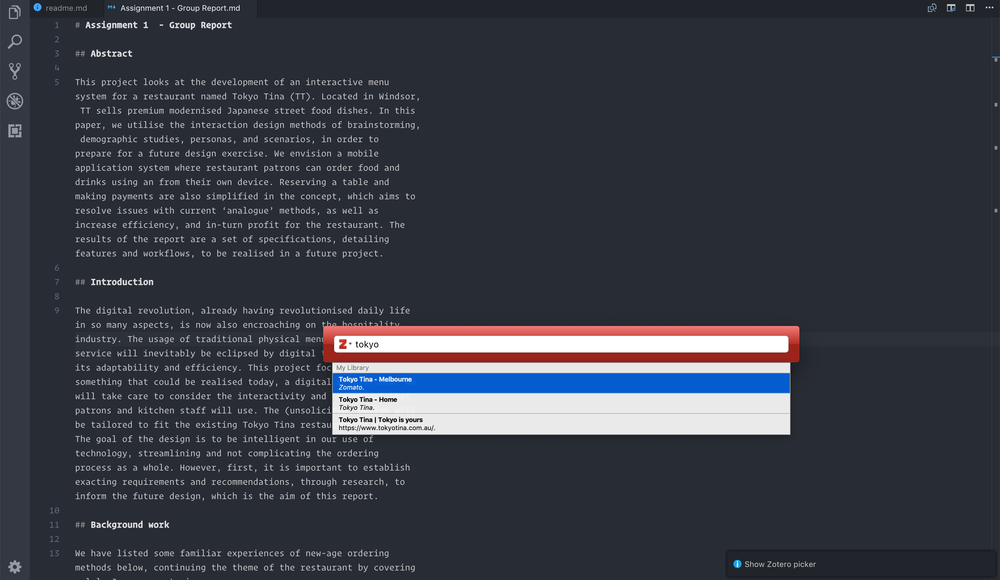

# VS Code Citation Picker for Zotero

This package adds Zotero support to VS Code Markdown editing. To use it, you will need to have the Better BibTeX plugin installed in Zotero.

## Features

If you don't feel like typing citations out (and let's be honest, you don't), executing 'Zotero Citation Picker' will call up a graphical picker which will insert these for you, formatted and all.

- Activate via Command Palette (command + shift + P): Type "Zotero Citation Picker" and press enter.
- Activate via keyboard shortcut: Use alt+shift+z

## Requirements

**IMPORTANT:** Zotero, with Better BibTeX installed, must be running while you use these.

## Configuration
The formats which are supported by this plugin depend on the [CAYW (Cite as you Write)](https://retorque.re/zotero-better-bibtex/citing/cayw/index.html) implementation by zotero-better-bibtex.

An excerpt of the formats that are supported are as follows:
- `cite` for latex, uses the cite command
- `biblatex` for biblatex, uses the autocite command
- `asciidoctor-bibtex`
- `jupyter`
- `typst`

This is not an exhaustive list. For more formats and further configuration options see the [better-bibtex documentation](https://retorque.re/zotero-better-bibtex/citing/cayw/index.html#diy).

To change the used format just replace `?format=pandoc` in the configuration with `?format=<chosen-format>`.
