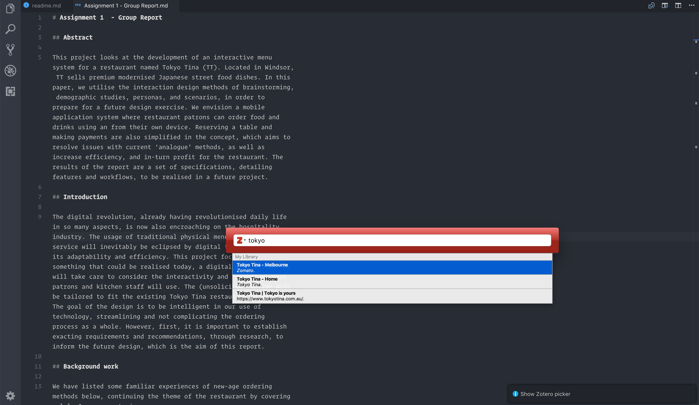

<a href="https://marketplace.visualstudio.com/items?itemName=mblode.zotero">
  
</a>

# VS Code Citation Picker for Zotero

This package adds Zotero support to VS Code Markdown editing. To use it, you will need to have the Better BibTeX plugin installed in Zotero.

## Features

If you don't feel like typing citations out (and let's be honest, you don't), executing 'Zotero Citation Picker' will call up a graphical picker which will insert these for you, formatted and all.

- Activate via Command Palette (command + shift + P): Type "Zotero Citation Picker" and press enter.
- Activate via keyboard shortcut: Use alt+shift+z



## Requirements

**IMPORTANT:** Zotero, with Better BibTeX installed, must be running while you use these.

## Configuration

The extension talks to Better BibTeX's [Cite as you Write (CAYW)](https://retorque.re/zotero-better-bibtex/citing/cayw/) endpoint. You can customise the URL it calls via the **Zotero Citation Picker: Port** setting (`zotero-citation-picker.port`). The default is:

```
http://127.0.0.1:23119/better-bibtex/cayw?format=pandoc
```

You can append CAYW query parameters to change the inserted text or behaviour:

- **Keep Zotero in the background** (don't steal focus after inserting): add `&minimize=true`.

  ```
  http://127.0.0.1:23119/better-bibtex/cayw?format=pandoc&minimize=true
  ```

- **Wrap citations in brackets** (Pandoc-style `[@key]`): add `&brackets=1`.

  ```
  http://127.0.0.1:23119/better-bibtex/cayw?format=pandoc&brackets=1
  ```

- **LaTeX / no leading `@`**: use a LaTeX format instead of `pandoc`, e.g. `format=biblatex` (inserts `\autocite{key}`) or `format=latex` with a command:

  ```
  http://127.0.0.1:23119/better-bibtex/cayw?format=biblatex
  ```

- **Plain citekey only** (no `@`, no brackets): use `format=playground`.

  ```
  http://127.0.0.1:23119/better-bibtex/cayw?format=playground
  ```

- **Juris-M** (or any fork on a different port): change the port, e.g. `24119` instead of `23119`.

See the [CAYW documentation](https://retorque.re/zotero-better-bibtex/citing/cayw/) for the full list of formats and options.
